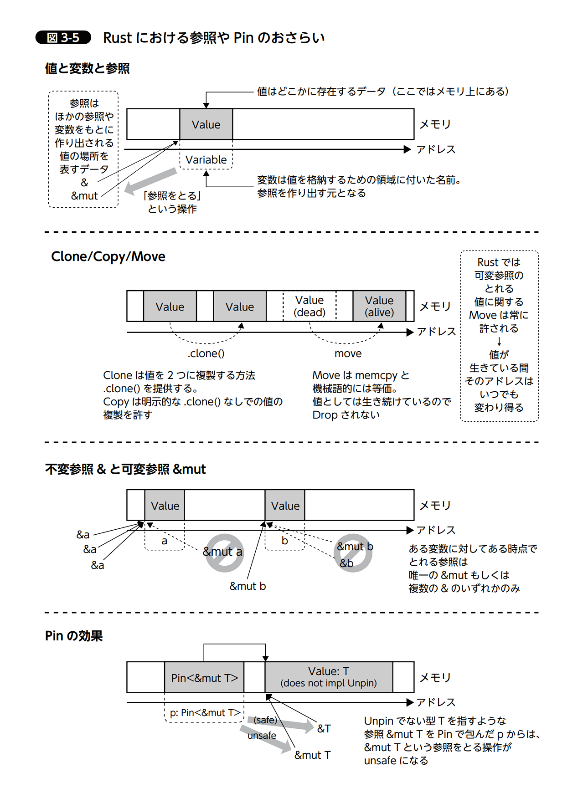

# EFIアプリケーションとは

EFIアプリケーションは、UEFI（Unified Extensible Firmware Interface）または元となるEFI（Extensible Firmware Interface）環境で動作するプログラムです。これらは、オペレーティングシステム（OS）が起動する前にファームウェアレベルで実行されるソフトウェアです[2][4]。

## 種類と役割

- **ブートローダー** - OSをロードして起動するためのプログラム[2]
- **オペレーティングシステムセレクター** - 複数のOSから起動するOSを選択するためのプログラム[2]
- **システム診断・修復ツール** - ハードウェアやシステムの問題を診断・修復するためのユーティリティ[2][4]
- **設定ツール** - システムやファームウェアの設定を変更するためのプログラム[4]
- **フラッシュROMアップデートツール** - ファームウェアをアップデートするためのユーティリティ[4]

## 技術的特徴

- UEFIと互換性のあるファイルシステム（FAT12、FAT16、FAT32、ISO-9660など）上に存在する必要がある
- C言語など近代的なプログラミング言語で開発可能[3][4]
- efi_main関数を持ち、EFIハンドルとシステムテーブルのポインタを引数として受け取る[3]
- UEFIが提供する様々なプロトコルを利用して機能を実装できる[3][4]

## 実行環境

- EFIアプリケーションを含むパーティションは**EFI System Partition（ESP）**と呼ばれる特別なパーティションに格納される[2]
- システム起動時に以下の順で処理が行われる：
  1. POST（power-on self-test）処理によるハードウェア診断
  2. UEFIによる基本コンポーネント（ビデオ出力、キーボード、ストレージメディアなど）の起動
  3. NVRAMに保存された設定に従ってESPからEFIアプリケーションの実行[2]

## EFIシェル

- コマンドライン環境を提供し、他のEFIアプリケーションを実行できる[4]
- OSを起動せずにシステムの診断や設定、ファイルの操作などが可能[4]
- .nsh拡張子を持つスクリプトファイルを実行できる（UNIXやMS-DOSのバッチファイルに類似）[4]
- TCP/IPスタックを利用したネットワーク通信も可能[4][5]

EFIアプリケーションにより、完全なOSを起動することなく特定の機能を実行できるため、システム管理やトラブルシューティングの面で大きな柔軟性を提供しています[4][5]。


# 文字の描画

文字の描画はドット絵のイメージで考えるとわかりやすい。

フォントデータであらかじめどこに点を打てば文字が描画できるかが定義されていて、そのデータを読み込んで画面に描画する。

フォントデータはビットマップフォントと呼ばれる。

ビットマップフォントはフォントの大きさをドットで表現したデータである。


```txt
........
...**...
...**...
...**...
...**...
..*..*..
..*..*..
..*..*..
..*..*..
.******.
.*....*.
.*....*.
.*....*.
***..***
........
........
```

その後、`writeln!`マクロを実装して、普段何気なく使っている文字の描画の裏側について学べた

## メモリマップ取得


## 図 3-5　 Rust における参照や Pin のおさらい




